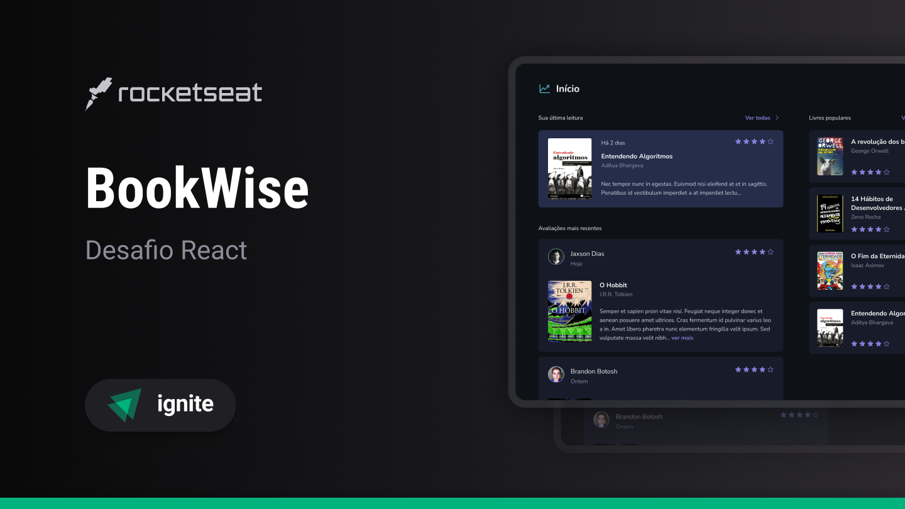

<h1 align="center">
  
</h1>

<p align="center">Ignite | Challenge - Book Wise</p>

<p align="center">
  <a href="#-projeto">Projeto</a>&nbsp;&nbsp;&nbsp;|&nbsp;&nbsp;&nbsp;
  <a href="#%EF%B8%8F-configura%C3%A7%C3%A3o-do-projeto">Configuração do Projeto</a>&nbsp;&nbsp;&nbsp;|&nbsp;&nbsp;&nbsp;
  <a href="#-licença">Licença</a>&nbsp;&nbsp;&nbsp;|&nbsp;&nbsp;&nbsp;
  <a href="#-autor">Autor</a>
</p>

<p align="center">
  <a href="https://github.com/jordane-chaves/challenge-04-book-wise/blob/main/LICENSE">
    
  </a>
</p>

## 💻 Projeto

**BookWise** é uma aplicação web para avaliação e gerenciamento de leituras. 

Para concluir este desafio, decidi separar o projeto em duas aplicações:
- **api**: Construída em Node.js (Fastify)
- **web**: Construída em React.js (Next.js)

Esse projeto é um dos desafios da trilha de React do bootcamp Ignite da Rocketseat.

<p align="center">
  
</p>

## ⚙️ Configuração do Projeto

### Pré-requisitos

- Node.js
- Docker e Docker Compose
- Credenciais do Google OAuth
- Credenciais do Github OAuth

> [!NOTE]
> Para gerar as credenciais OAuth acesse os painéis: [Google](https://console.cloud.google.com/) e [Github](https://github.com/settings/developers).
> 
> Se tiver alguma dúvida ao obter as credenciais OAuth, acesse as documentações oficiais.
> - [Documentação OAuth2.0 Google](https://developers.google.com/identity/protocols/oauth2?hl=pt-br)
> - [Documentação OAuth Github](https://docs.github.com/en/apps/oauth-apps/building-oauth-apps/creating-an-oauth-app)

### 1. Clone o repositório

```bash
git clone https://github.com/jordane-chaves/challenge-04-book-wise.git
```

### 2. Configure a API

Acesse a [Documentação da API](https://github.com/jordane-chaves/challenge-04-book-wise/blob/main/api/README.md)

### 3. Configure a aplicação WEB

Acesse a [Documentação da WEB](https://github.com/jordane-chaves/challenge-04-book-wise/blob/main/web/README.md)

## 📝 Licença

Esse projeto está sob a licença MIT - veja o arquivo [LICENSE](https://github.com/jordane-chaves/challenge-04-book-wise/blob/main/LICENSE) para mais detalhes.

## 👨🏻‍💻 Autor


Feito com 💜 por Jordane Chaves