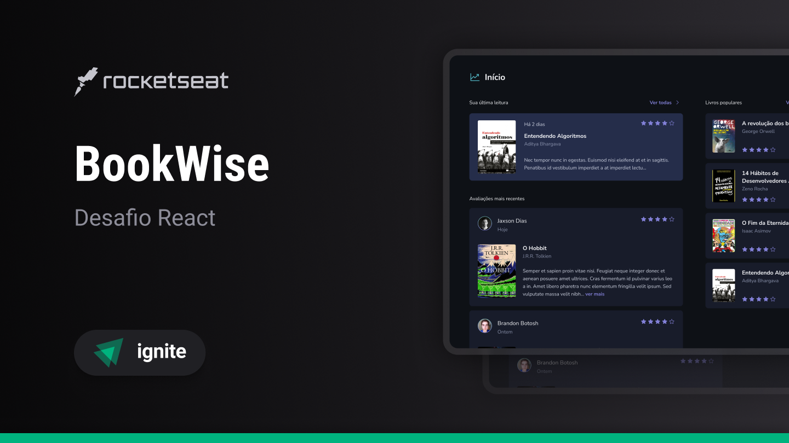

<h1 align="center">
  
</h1>

<p align="center">Ignite | Challenge - Book Wise Frontend</p>

<p align="center">
  <a href="#-tecnologias">Tecnologias</a>&nbsp;&nbsp;&nbsp;|&nbsp;&nbsp;&nbsp;
  <a href="#%EF%B8%8F-configura%C3%A7%C3%A3o-do-projeto">Configuração do Projeto</a>&nbsp;&nbsp;&nbsp;|&nbsp;&nbsp;&nbsp;
  <a href="#-como-executar">Como Executar</a>&nbsp;&nbsp;&nbsp;|&nbsp;&nbsp;&nbsp;
  <a href="#-autor">Autor</a>
</p>

<p align="center">
  
</p>

## 🚀 Tecnologias

Esse projeto foi desenvolvido com as seguintes tecnologias:

- [TypeScript](https://www.typescriptlang.org/)
- [Next.js](https://nextjs.org/)
- [Tailwind](https://tailwindcss.com/)
- [Zod](https://zod.dev/)

## ⚙️ Configuração do Projeto

### Pré requisitos

**OAuth**

- Credenciais OAuth do Google
- Credenciais OAuth do Github

### 1. Acesse o diretório do projeto

```bash
cd ./challenge-04-book-wise/web/
```

### 2. Configure as variáveis de ambiente

Crie uma cópia do arquivo `.env.example` para `.env`

```bash
cp .env.example .env
```

> [!IMPORTANT]
> As variáveis de ambiente precisam ser preenchidas para prosseguir.

### 3. Instale as dependências

```bash
npm install
```

## 🎲 Como executar

### Ambiente de Desenvolvimento

Execute a aplicação em modo de desenvolvimento

```bash
npm run dev
```

> A aplicação inciará na porta 3000 - acesse <http://localhost:3000>

## 👨🏻‍💻 Autor


Feito com 💜 por Jordane Chaves